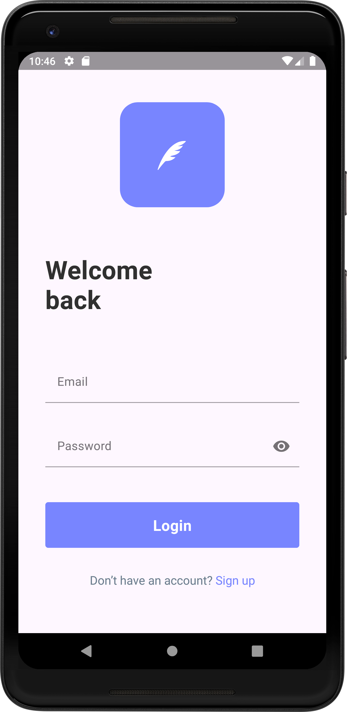
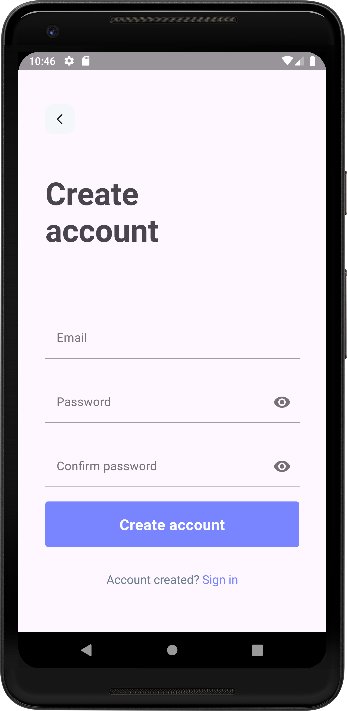
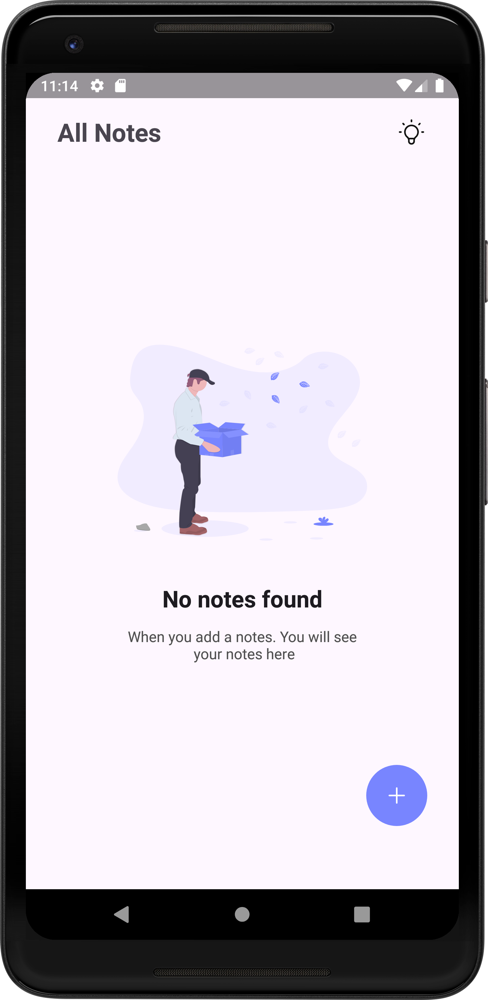
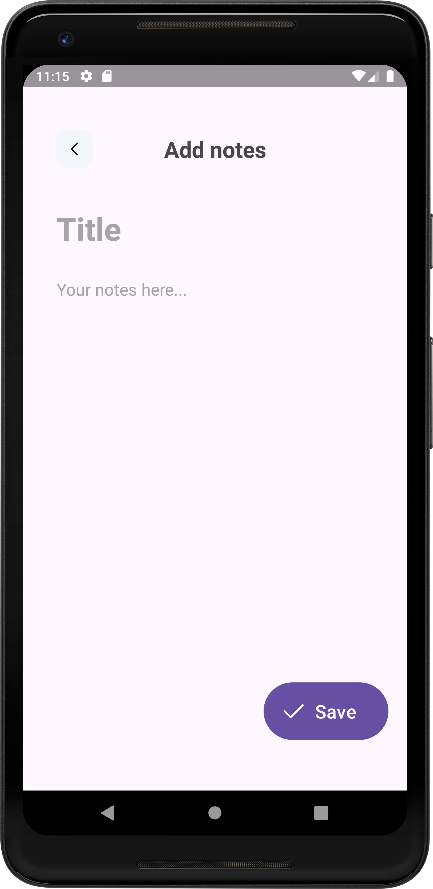
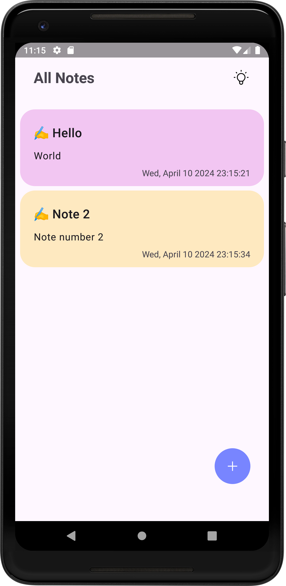

# Android Application Documentation: NoteApp
**NoteApp** is an Android application built using Kotlin and follows the MVVM (Model-View-ViewModel) architecture. 

---
# Project Structure
```
NoteApp
├── Adapter
│   └── NoteListAdapter.kt
├── Database
│   ├── NoteDao
│   ├── NoteDatabase
│   └── NoteRepository
├── Model
│   ├── Note
│   ├── NoteViewModel
│   └── User
├── Utilities
│   ├── constants.kt
├── AddNoteActivity
├── LoginActivity
├── MainActivity
├── NoteRecyclerViewActivity
└── RegisterActivity
```
## Self notes of what's been using
### NoteListAdapter:
- NoteListAdapter extends ListAdapter, a RecyclerView adapter that uses DiffUtil to calculate the minimum number of changes between old and new lists.
- Data Binding: Used in conjunction with the ViewHolder pattern to bind data to the UI components within each item of the RecyclerView; View Binding
```
    Inflate the layout for each item of the RecyclerView.
    Bind data to the UI components within each item.
    Handle user interactions with each item (such as clicks and long clicks).
```

### Dao interface
- Defines methods for performing Create, Read, Update, and Delete (CRUD) operations in the database

### Database class
- An abstract class that extends RoomDatabase. It serves as the main access point to the underlying SQLite database. 
- The database operations are performed via the DAO (Data Access Object) interfaces.

### Repository class
- Serves as an abstraction layer between the different data sources and the rest of the application. 
- It provides a clean API for data access to the rest of the application.
- Help observe through LiveData and perform database operations with Coroutines
### ViewModel class
- Use AndroidViewModel, LiveData, Coroutines to  manage UI-related data in a lifecycle conscious way, allowing data to survive configuration changes such as screen rotations.

*AddNoteActivity and NoteRecyclerViewActivity communicate with each other using Android’s ***startActivityForResult*** and ***registerForActivityResult*** mechanisms. Here’s how they work:*

### AddNoteActivity
When the user finishes editing a note or creating a new one in AddNoteActivity, it creates an Intent and puts the Note object into it as an extra. This Intent is then set as the result of the activity, and the activity is finished. The Note object within the Intent contains the data entered by the user.

### NoteRecyclerViewActivity
NoteRecyclerViewActivity starts AddNoteActivity for result when a note item is clicked in the RecyclerView. It passes the clicked note to AddNoteActivity through the Intent.

When AddNoteActivity finishes, NoteRecyclerViewActivity receives the result in the ActivityResult callback. If the result contains a Note object, it inserts or updates the note in the database through the NoteViewModel.

---
## Technologies
- MVVM: This model helps separate application logic from the user interface.
- Room: Used for data storage, it’s an abstraction layer over SQLite.
- Coroutines: Used in Kotlin for handling asynchronous tasks.
- Firebase Authentication: Used to manage user authentication.

## Image

| | | |
|---|---|---|
|  |  |  |
|  |  |  &nbsp;  |  ```